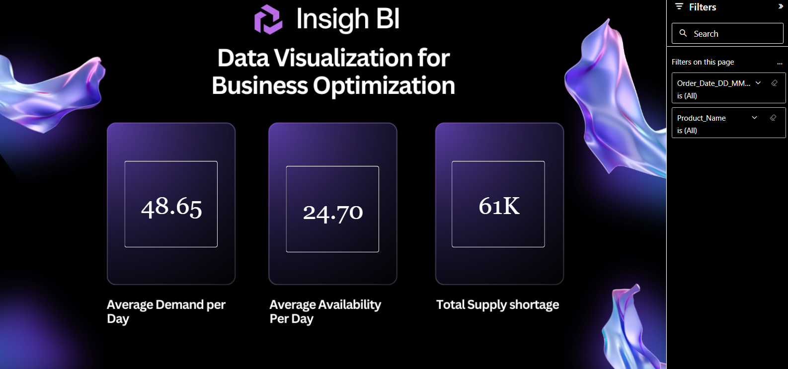
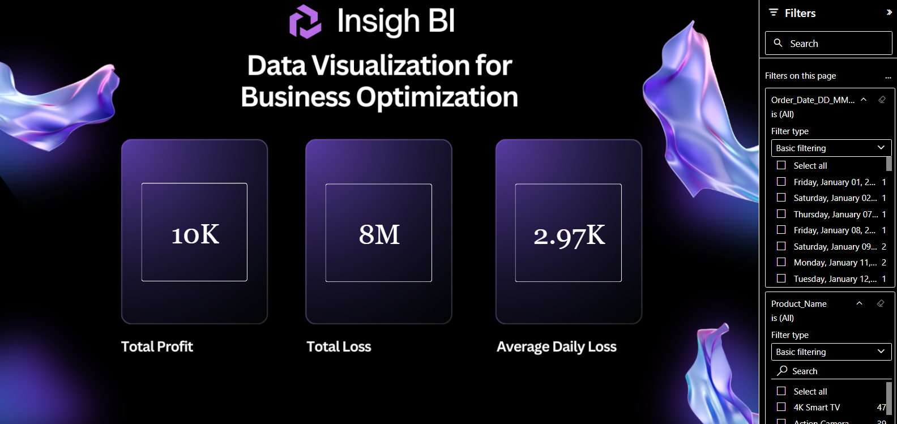

# 📊 InsightFlow — Sales & Inventory Analytics Dashboard

## 📌 Overview
InsightFlow is a Power BI analytics project designed to monitor sales performance, inventory availability, and demand gaps for smarter business decisions.

---

## 🛠️ Tech Stack
- SQL Server (SSMS)
- MySQL
- Power BI (.pbip)
- Power Query Editor

---

## 🚀 How to Use
1. Clone or download this repository  
2. Open the `.pbip` file in Power BI Desktop  
3. Ensure both `Report` and `SemanticModel` folders are present  
4. Refresh data if needed  

> ⚠️ This project uses `.pbip` format — all folders are already included.

---

## 📊 Key Features
- KPI dashboard (Sales, Profit, Demand, Availability)
- Dynamic filtering (Product, Date)
- Inventory shortage analysis
- Clean, dark-themed UI

---

## 🔄 Data Workflow
- Data processed using SQL Server & MySQL  
- Cleaned and transformed using Power Query  
- Visualized in Power BI  

---

## 📸 Dashboard Preview

### 📊 Dashboard 1

### 📊 Dashboard 2

---

## 💡 Insights
- Detect high-demand, low-availability products  
- Monitor profit and loss trends  
- Improve inventory planning with data insights  

---

## 📬 Contact
Feel free to fork and extend this project with new features and insights, 
